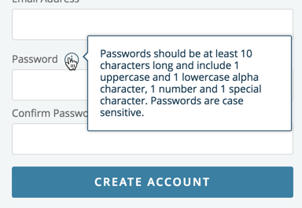

- `action-sheet` нужно использовать, чтобы предложить пользователю выбор, вызванный его действиями
- `alert-prompt` нужно использовать, чтобы принудить пользователя сделать выбор, необходимость которого не связана с действиями пользователя, а например, инициирована системой
- Если пользователя нужно просто о чем-то **оповестить без выбора**, то **оповещение** должно быть **нативно интегрировано в UI** (какой-либо **индикатор** или **тост/оповещение**)
- Если пользователю нужно **посмотреть или провзаимодействовать с item'ом**, то нужно экспертным (интуитивным) путем **определить самостоятельность этого действия**:
    - Если действие **самостоятельное** и несильно привязано к контексту списка всех item'ов, то нужно **открыть item в отдельном view** / отдельной странице
    - Если действие **ощутимо привязано к контексту** \[списка\], то нужно открыть item в **sheet-modal**

- TODO:
    - Тултип, поповер

---

**Тултип**: \
Не использовать для информации, которая необходима для выполнения задачи. \
Пользователи не должны искать тултип, чтобы завершить свою задачу:

Тултип должен быть помощником для принятия решений в ситуациях, незнакомых пользователю:
"Что будет, если нажать на эту кнопку"
